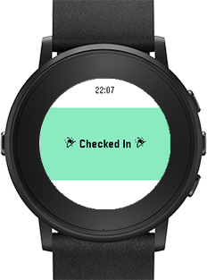

Switt
===

Simple Swarm (Foursquare)  client for Pebble which can post to Twitter.



## Requirement

* [Pebble SDK](https://developer.pebble.com/sdk/)

## Setup

Replace configuration page URL. `src/js/config.js`

Source code of configuration page is [here](https://github.com/STAR-ZERO/switt-configuration).

## Development

### Launch emulator

```
$ pebble build && pebble install --emulator chalk
```

### Open configuration

```
$ pebble emu-app-config
```

### Log

```
$ pebble logs
```

## Document

[Pebble Developers](https://developer.pebble.com/)
